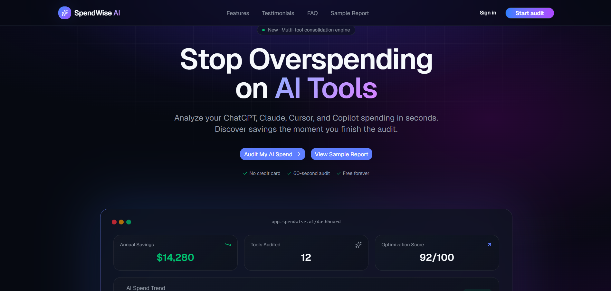
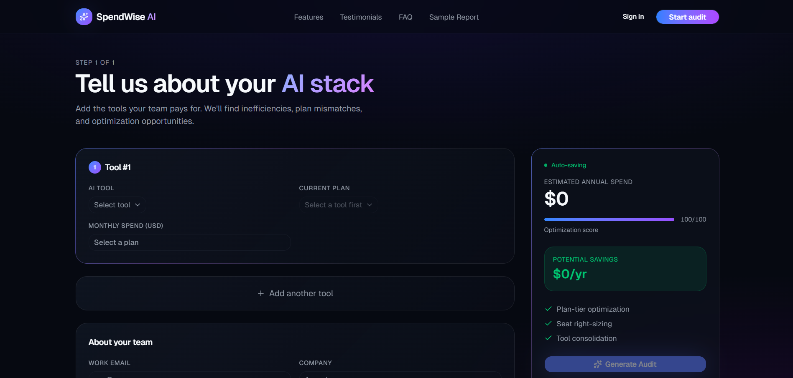
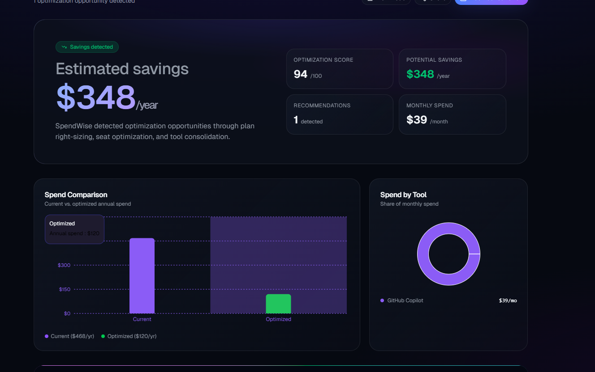
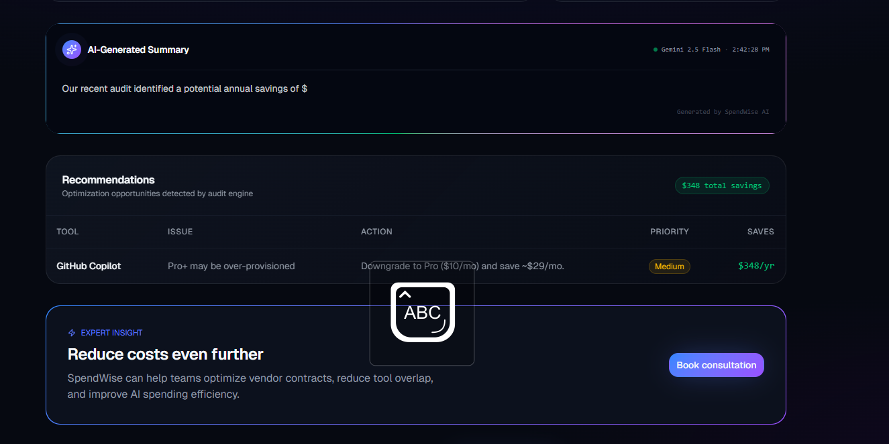

# SpendWise AI

SpendWise AI is a free AI spend audit tool for startup founders and engineering managers — enter your AI tool subscriptions, get an instant breakdown of where you're overspending, what to downgrade, and how much you'd save annually. No login required.

**Live URL:** https://spendwise-ai.vercel.app
**Repo:** https://github.com/rishabh-1510/SpendWise-Ai

---

## Screenshots





---

## Quick Start

```bash
# 1. Clone
git clone https://github.com/rishabh-1510/SpendWise-Ai.git
cd SpendWise-Ai/spendwise-ai

# 2. Install
npm install

# 3. Environment variables
cp .env.example .env
# Add VITE_GEMINI_API_KEY=your_key_here

# 4. Run locally
npm run dev

# 5. Build for production
npm run build
```

**Deploy to Vercel:**
```bash
vercel --prod
```
Set `VITE_GEMINI_API_KEY` in Vercel's environment variables dashboard.

---

## Decisions

**1. localStorage over a backend database for audit state**
The audit data is self-contained — it's computed client-side from user input and pricing rules. Adding a database for read/write of form state would introduce latency, infrastructure cost, and auth complexity for zero functional gain in the prototype. The trade-off is that data is lost if the user clears storage, which is acceptable for a tool used once or twice.

**2. URL-encoded sharing instead of server-generated share IDs**
Each share link encodes the full audit payload as base64 in a `?data=` query param rather than storing the audit server-side and returning a UUID. This means zero backend involvement for sharing, instant link generation, and no storage costs. The trade-off is URL length (~1–2 KB) and that extremely large audits could theoretically exceed browser URL limits — mitigated with a size warning at 6 KB.

**3. Hardcoded audit rules over ML/AI for the audit engine**
The assignment explicitly notes that knowing when *not* to use AI is part of the test. A finance-literate person should be able to read the audit reasoning and agree with it. Hardcoded rules (enterprise plan under 20 seats, team plan for ≤2 users, overlapping tools in same category) are transparent, auditable, and deterministic. An LLM would introduce hallucinated savings figures and opaque reasoning.

**4. Gemini 2.5 Flash over Anthropic API for the AI summary**
The AI summary is a low-stakes, high-volume feature — it generates a ~100-word paragraph, not a decision. Gemini 2.5 Flash has a generous free tier and fast latency. The trade-off: the assignment preferred Anthropic API. Mitigation: the `generateAISummary` function is fully abstracted behind an interface, so swapping to Anthropic is a one-file change. A graceful fallback renders a templated summary if the API is unavailable.

**5. Vite + React over Next.js**
This is a pure client-side tool — no SSR, no API routes, no database queries in the request path. Next.js would add build complexity and cold-start overhead for zero benefit. Vite gives faster dev HMR and a smaller production bundle. The trade-off is no server-side rendering for SEO — mitigated by Open Graph meta tags in `index.html` and the fact that the shareable report URL encodes data in the query string rather than a path segment, so crawlers see the same shell.